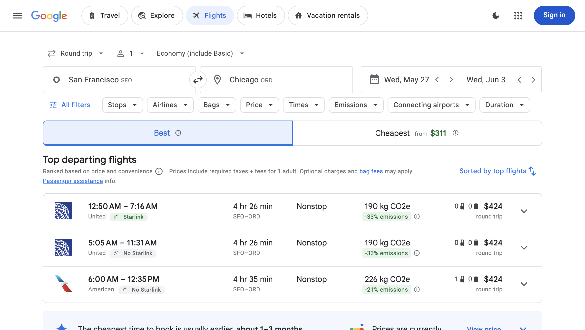
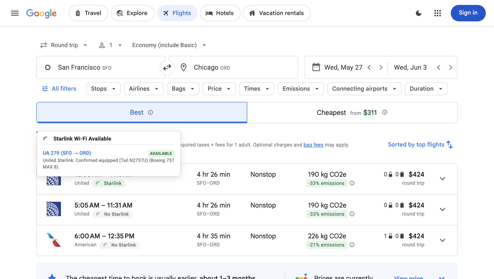

# Google Flights Starlink Checker

> *definetly not a vibecoded chrome extension that was coded in 20 minutes*

Google Flights Starlink Checker is a Chrome extension that detects and displays SpaceX Starlink Wi-Fi availability on Google Flights search results. The extension queries live fleet tracking databases and applies airline-specific fleet rules to verify in-flight connectivity for individual flights.

---

## The Backstory

This extension was born out of necessity. As a frequent business traveler, reliable in-flight Wi-Fi is one of the most critical factors when booking flights. Having a fast, low-latency connection determines whether a flight is productive work time or dead hours. 

To ensure Starlink access, I am the type of traveler who will willingly select a longer, more expensive, or less convenient flight routing if it guarantees a stable high-speed internet connection. This extension was built to eliminate the manual cross-referencing and guesswork during the flight selection process on Google Flights.

---

## Visual Previews

### 1. Injected Starlink Badges
The extension inserts Material-designed badges adjacent to the airline names. The badges are color-coded to indicate connectivity status:
* **Starlink** (Green): Confirmed Starlink availability on the flight.
* **Starlink Likely / Partial** (Blue): Starlink rollout is active on the fleet, or there is partial availability on multi-segment itineraries.
* **No Starlink** (Gray): The flight operates with legacy satellite or air-to-ground Wi-Fi.



### 2. Multi-Segment Portal Tooltips
Hovering over a badge displays a portal-injected tooltip showing a detailed breakdown of each individual flight leg, including the specific tail number (when assigned) and aircraft model.



---

## Why This Extension is Superior

Compared to other extensions available on the Chrome Web Store, this extension is designed from the ground up to solve the specific limitations of existing tools:

### 1. *Google Flights Starlink Indicator* (jjfljoifenkfdbldliakmmjhdkbhehoi)
* **The Issue:** This extension is completely non-functional on modern Google Flights. You can perform searches, but no badges or indicators ever render.
* **Why Ours is Better:** This extension broke because Google Flights enforces a strict **Trusted Types** security policy. It attempts to inject HTML templates using `innerHTML`, which Chrome intercepts and blocks. Our extension constructs all SVG icons, badge wrappers, and tooltips programmatically using standard DOM APIs (`document.createElementNS` and `appendChild`). It runs with zero runtime security exceptions.

### 2. *SeatWiFi - Flight WiFi Checker* (gkgmfcdkcemfcohoifeaebjlchpaphja)
* **The Issue:** While accurate for legacy, slow Wi-Fi providers (Viasat, Panasonic, Gogo), it displays inaccurate or missing information for Starlink rollouts. It does not track retrofitted aircraft individually.
* **Why Ours is Better:** SeatWiFi relies on coarse, static datasets matching by airline or aircraft type. During active rollouts (e.g., United Airlines retrofitting planes week-by-week), static rules fail. Our extension utilizes a **hybrid verification waterfall**:
  * **Real-time Tail Lookups:** For airlines like United, it queries a live tracking API to fetch the *exact tail number* assigned to the flight on your travel date. If the plane has had the Starlink radome installed, it confirms it immediately.
  * **Model-Specific Scraper:** It scrapes scheduled aircraft models from expanded flight cards, matching specific configurations (such as Hawaiian A321neo/A330 vs. 717s or Qatar 777s/A350s vs. 787s).
  * **No Legacy Noise:** Designed specifically for travelers who prioritize Starlink connectivity, making it easy to filter out legacy systems.

---

## Key Features

* **Single Page Application (SPA) Support:** Tracks dynamically loaded flights and filter updates on Google Flights using a throttled `MutationObserver` without impacting page performance.
* **Live Fleet Database Queries:** Queries a CORS-compliant proxy worker linked to the United Airlines tracker API to fetch tail-number records in real time.
* **Persistent Local Caching:** Utilizes a 24-hour cache (`chrome.storage.local`) to reduce duplicate API requests and network overhead.
* **Dynamic Details Scraper:** Extracts scheduled aircraft models from the card details panel once a flight row is expanded, applying specific airline heuristics on the fly.
* **Trusted Types Compatibility:** Fully compatible with Google Flights' strict browser security configurations, using programmatic node generation to prevent Trusted HTML violations.

---

## Heuristic and Rule Waterfall

When a flight card is detected on Google Flights, the extension parses the itinerary parameters and runs the following ruleset:

1. **JSX & ZIPAIR:** 100% fleet-wide rollout. Automatically returns **Available**.
2. **airBaltic:** 100% of the Airbus A220-300 fleet is actively undergoing installation. Returns **Available**.
3. **Hawaiian Airlines:** Airbus jets (A321neo & A330-200) are equipped; Boeing jets (787-9) are actively rolling out; Boeing 717s are not supported.
4. **Qatar Airways:** Completed installation on entire Boeing 777 and Airbus A350 fleets (returns **Available**). Active rollout in progress on Boeing 787s.
5. **Emirates:** Active rollout in progress on Boeing 777 aircraft. Returns **Likely** for 777s as more aircraft are retrofitted.
6. **United Airlines:** Queries the tracker database for the exact tail number assigned (e.g., `N2737U`). If no tail number is assigned yet (flights booked far in advance), it falls back to model-specific rollout heuristics.
7. **Delta, American, Southwest, JetBlue:** Marked as **No Starlink** (Legacy Wi-Fi providers Viasat, Panasonic, or Gogo).

---

## Project Structure

```
starlinkonly/
├── manifest.json         # Manifest V3 extension configuration
├── background.js         # API proxy worker and local storage cache manager
├── content.js            # DOM parser, rules engine, and badge injector
├── styles.css            # Stylesheets with light/dark theme variables
├── popup.html            # Extension dashboard UI
├── popup.js              # Dashboard controller (rollout statistics, manual check)
├── popup.css             # Dashboard styling
├── test_flights.html     # Interactive local testing suite
└── icons/
    └── icon.svg          # Extension logo (custom vector graphic)
```

---

## Setup and Installation

### Option A: Loading on Live Google Flights
1. Clone or download this repository.
2. Open Google Chrome and go to `chrome://extensions/`.
3. Toggle the **Developer mode** switch in the top-right corner.
4. Click **Load unpacked** in the top-left corner.
5. Select the `starlinkonly/` directory.
6. Open [Google Flights](https://www.google.com/travel/flights) and perform a search.

### Option B: Local Test Suite
To verify rendering and interactive features offline:
1. Double-click the `test_flights.html` file to open it in Chrome.
2. Click individual cards to simulate expansion and trigger aircraft model scraping.
3. Use the **Switch to Dark Mode** button in the header to verify theme adaptation.

---

## Security Architecture: Chrome Trusted HTML Compliance

Modern Google web properties enforce a strict **Trusted Types** policy. Direct assignments to `element.innerHTML` or `element.outerHTML` are intercepted by Chrome and blocked to prevent Cross-Site Scripting (XSS) attacks.

To satisfy these security constraints, the extension constructs all DOM nodes and inline vector graphics programmatically:
```javascript
const svg = document.createElementNS("http://www.w3.org/2000/svg", "svg");
const path = document.createElementNS("http://www.w3.org/2000/svg", "path");
svg.appendChild(path);
```
This ensures zero runtime security violations and maximum reliability across Google domains.
